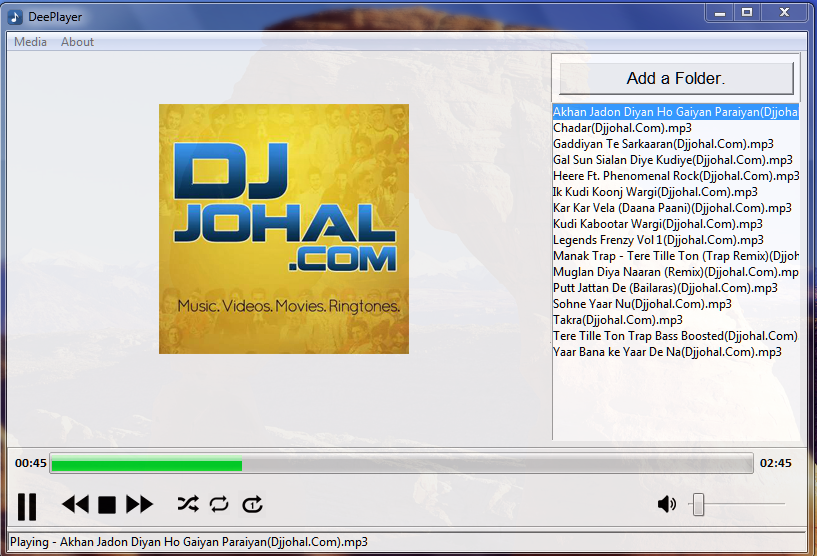

## DeePlayer

## Summary

This is a music player application named as DeePlayer. This have all the features required in a music player. This is the most advanced music player made with python and Tkinter on Github.

## Features

1. Play/Pause

2. Next Track

3. Stop Music

4. Previous Track

5. Shuffle All

6. Repeat All

7. Repeat One

8. Mute

9. Adjust Volume

10. Open Folder

11. Open File

12. Select Particular Track From The Playlist

13. Transparent Window

14. Advanced GUI

15. Userfriendly Interface

16. Label to describe the buttons

17. Working Progress Bar

18. Current Duration of track and Total duration of track

19. Album Art

## How To Run

Just run the main.py file from the folder.

## Requirement

1. Python 3.6 or above

2. Pygame module

3. Mutagen

## Screenshots

